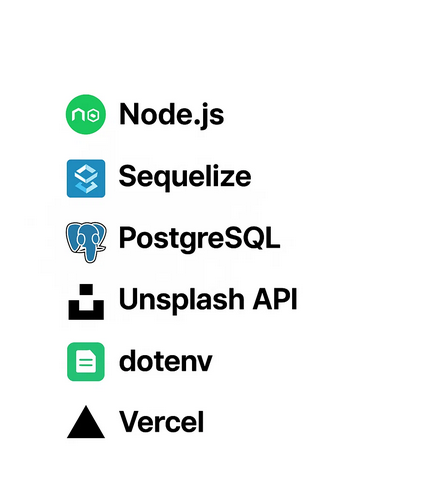
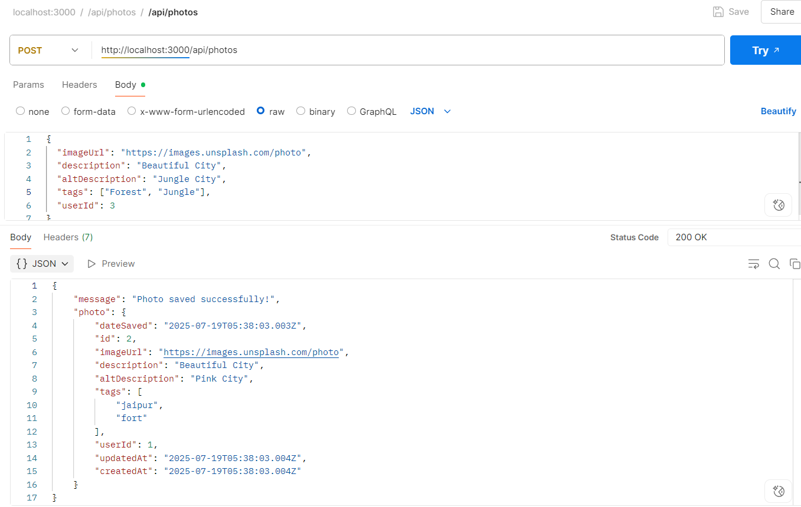
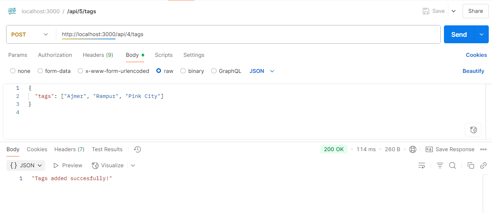
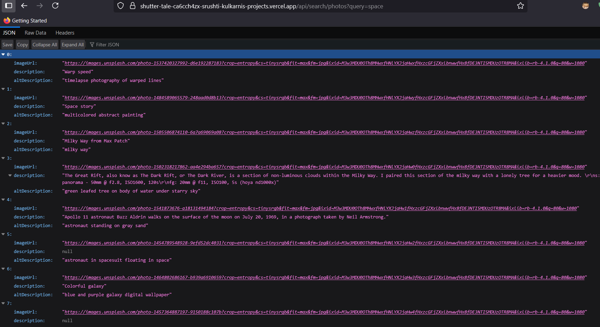

# 📸 Shuttertale

Shuttertale is a backend application built with **Node.js**, **Express**, and **Sequelize**, serving as the core API for managing user-submitted photos, tags, and image search functionality powered by **Unsplash API**. It supports PostgreSQL (hosted on Supabase) and is deployed via **Vercel serverless functions**.

---

## 🔧 Tech Stack


---

## 🚀 Features

- 🔍 Search and fetch images from **Unsplash**
- 📸 Upload and manage **user photos**
- 🏷️ Tagging system
- 📚 Maintain **search history** per user
- ✅ Fully RESTful API
- ☁️ Deployed on **Vercel** (serverless)

---


---

## 🛠️ Environment Variables

Create a `.env` file at the root with the following:

```env
DB_USER=your_supabase_db_user
DB_PASSWORD=your_db_password
DB_NAME=postgres
DB_HOST=your_db_host.supabase.co
DB_PORT=6543
PORT=3000

UNSPLASH_ACCESS_KEY=your_unsplash_key
UNSPLASH_BASE_URL=https://api.unsplash.com

---

🚀 Getting Started

1. Clone and Install

git clone https://github.com/your-username/shuttertale.git
cd shuttertale
npm install

2. Setup the .env file

3. Run the development server

   npm start

---

### 📝 API Endpoints

| HTTP Method | Endpoint                | Description                    |
|-------------|------------------------|-------------------------------|
| POST        | /api/users             | Create a new user              |
| GET         | /api/search/photos     | Search photos using Unsplash API |
| POST        | /api/photos            | Save user-uploaded photos      |
| POST        | /api/:photoId/tags     | Add tags to a photo            |
| GET         | /api/photos/tag/search | Search photos by tags          |
| GET         | /api/search-history    | Get user search history        |

---

🧪 Running Tests

npm test

---
Sequelize Commands

Run migrations:
npx sequelize db:migrate

Seed data:
npx sequelize db:seed:all






